# Execution Plan — Portfolio Insight & Archiver

## Detailed Analysis Summary

### Change Impact Assessment

| 観点 | 内容 |
|---|---|
| **User-facing changes** | Yes — 全機能が新規。ポートフォリオ分析UI・アーカイブ機能 |
| **Structural changes** | Yes — フルスタック新規設計（Vue.js + Spring Boot + SQLite + 外部API） |
| **Data model changes** | Yes — スナップショット・銘柄データ・J-Quantsデータのスキーマ定義が必要 |
| **API changes** | Yes — 新規REST API設計（CSVインポート・分析・アーカイブ） |
| **NFR impact** | Yes — Google OAuth・Security Baseline適用・J-Quants APIキャッシュ |

### Risk Assessment

| 項目 | 評価 |
|---|---|
| **Risk Level** | Medium-High |
| **Rollback Complexity** | Easy（ローカルDocker、本番環境なし） |
| **Testing Complexity** | Moderate（外部API連携のモック・OAuth フロー） |

**リスク要因**:
- J-Quants API の認証・レート制限への対応
- Google OAuth 2.0 フローの実装（認証コード・トークン管理）
- Docker Compose でのサービス間通信設計
- SBI証券CSVのパース（文字コード・フォーマット変動リスク）

---

## Workflow Visualization

```mermaid
flowchart TD
    Start(["ユーザーリクエスト"])

    subgraph INCEPTION["INCEPTION PHASE"]
        WD["Workspace Detection<br/><b>COMPLETED</b>"]
        RA["Requirements Analysis<br/><b>COMPLETED</b>"]
        US["User Stories<br/><b>SKIP</b>"]
        WP["Workflow Planning<br/><b>IN PROGRESS</b>"]
        AD["Application Design<br/><b>EXECUTE</b>"]
        UG["Units Generation<br/><b>EXECUTE</b>"]
    end

    subgraph CONSTRUCTION["CONSTRUCTION PHASE"]
        FD["Functional Design<br/><b>EXECUTE per unit</b>"]
        NFRR["NFR Requirements<br/><b>EXECUTE per unit</b>"]
        NFRD["NFR Design<br/><b>EXECUTE per unit</b>"]
        ID["Infrastructure Design<br/><b>EXECUTE per unit</b>"]
        CG["Code Generation<br/><b>EXECUTE always</b>"]
        BT["Build and Test<br/><b>EXECUTE always</b>"]
    end

    subgraph OPERATIONS["OPERATIONS PHASE"]
        OPS["Operations<br/><b>PLACEHOLDER</b>"]
    end

    Start --> WD
    WD --> RA
    RA --> US
    US --> WP
    WP --> AD
    AD --> UG
    UG --> FD
    FD --> NFRR
    NFRR --> NFRD
    NFRD --> ID
    ID --> CG
    CG --> BT
    BT --> OPS
    OPS --> End(["Complete"])

    style WD fill:#4CAF50,stroke:#1B5E20,stroke-width:3px,color:#fff
    style RA fill:#4CAF50,stroke:#1B5E20,stroke-width:3px,color:#fff
    style US fill:#BDBDBD,stroke:#424242,stroke-width:2px,stroke-dasharray: 5 5,color:#000
    style WP fill:#4CAF50,stroke:#1B5E20,stroke-width:3px,color:#fff
    style AD fill:#FFA726,stroke:#E65100,stroke-width:3px,stroke-dasharray: 5 5,color:#000
    style UG fill:#FFA726,stroke:#E65100,stroke-width:3px,stroke-dasharray: 5 5,color:#000
    style FD fill:#FFA726,stroke:#E65100,stroke-width:3px,stroke-dasharray: 5 5,color:#000
    style NFRR fill:#FFA726,stroke:#E65100,stroke-width:3px,stroke-dasharray: 5 5,color:#000
    style NFRD fill:#FFA726,stroke:#E65100,stroke-width:3px,stroke-dasharray: 5 5,color:#000
    style ID fill:#FFA726,stroke:#E65100,stroke-width:3px,stroke-dasharray: 5 5,color:#000
    style CG fill:#4CAF50,stroke:#1B5E20,stroke-width:3px,color:#fff
    style BT fill:#4CAF50,stroke:#1B5E20,stroke-width:3px,color:#fff
    style OPS fill:#FFF59D,stroke:#F57F17,stroke-width:2px,color:#000
    style Start fill:#CE93D8,stroke:#6A1B9A,stroke-width:3px,color:#000
    style End fill:#CE93D8,stroke:#6A1B9A,stroke-width:3px,color:#000

    linkStyle default stroke:#333,stroke-width:2px
```

---

## Phases to Execute

### 🔵 INCEPTION PHASE

- [x] Workspace Detection — **COMPLETED**
- [x] Reverse Engineering — **SKIP**（グリーンフィールド）
- [x] Requirements Analysis — **COMPLETED**
- [ ] User Stories — **SKIP**
  - **Rationale**: 個人利用のシングルユーザーツール。複数ペルソナなし。要件が明確で受け入れ基準に関するチームコラボレーション不要。
- [x] Workflow Planning — **IN PROGRESS**
- [ ] Application Design — **EXECUTE**
  - **Rationale**: 複数の新規コンポーネント（Vue.js SPA・Spring Bootサービス群・SQLiteリポジトリ・外部APIクライアント）が必要。コンポーネント設計・依存関係・インターフェース定義が不可欠。
- [ ] Units Generation — **EXECUTE**
  - **Rationale**: 4つの独立したユニット（backend-core・jquants-integration・google-docs-integration・frontend）に分解が必要。各ユニットを独立して設計・実装する。

### 🟢 CONSTRUCTION PHASE（ユニットごとに繰り返す）

- [ ] Functional Design — **EXECUTE**（per unit）
  - **Rationale**: 新規データモデル（snapshot・holding・stock_meta）・複雑なビジネスロジック（差分計算・AI プロンプト生成・セクター集計）が必要。
- [ ] NFR Requirements — **EXECUTE**（per unit）
  - **Rationale**: Security Baseline 15ルール適用。Google OAuth・J-Quants APIキャッシュ・入力バリデーション・構造化ログ等のNFR対応が必要。
- [ ] NFR Design — **EXECUTE**（per unit）
  - **Rationale**: NFR Requirementsを実行するため、NFRパターンをアーキテクチャに組み込む設計が必要。
- [ ] Infrastructure Design — **EXECUTE**（per unit）
  - **Rationale**: Docker Compose・環境変数管理・Google OAuth設定・J-Quants APIキー管理・ネットワーク設定が必要。
- [ ] Code Generation — **EXECUTE**（always）
- [ ] Build and Test — **EXECUTE**（always）

### 🟡 OPERATIONS PHASE

- [ ] Operations — **PLACEHOLDER**

---

## Anticipated Units

| Unit | 担当領域 |
|---|---|
| **backend-core** | CSVインポート・ポートフォリオ分析・AIプロンプト生成・SQLite永続化 |
| **jquants-integration** | J-Quants APIクライアント・株式メタデータ取得・キャッシュ |
| **google-docs-integration** | Google OAuth 2.0・Google Docs API・スナップショットアーカイブ |
| **frontend** | Vue.js 3 + Vite・分析ダッシュボード・AIプロンプト表示UI |

> **Note**: 最終的なユニット定義はUnits Generationステージで確定する。

---

## Success Criteria

| 指標 | 内容 |
|---|---|
| **Primary Goal** | SBI証券CSVを取り込み、J-Quantsデータで補完し、Google Docsにスナップショットを保存する |
| **Key Deliverables** | Vue.js フロントエンド・Spring Boot バックエンド・Docker Compose 構成・Google Docs アーカイブ機能 |
| **Quality Gates** | Security Baseline 15ルール準拠・J-Quants APIエラー時のグレースフルデグラデーション・Google Docs API障害時の安全なフォールバック |
